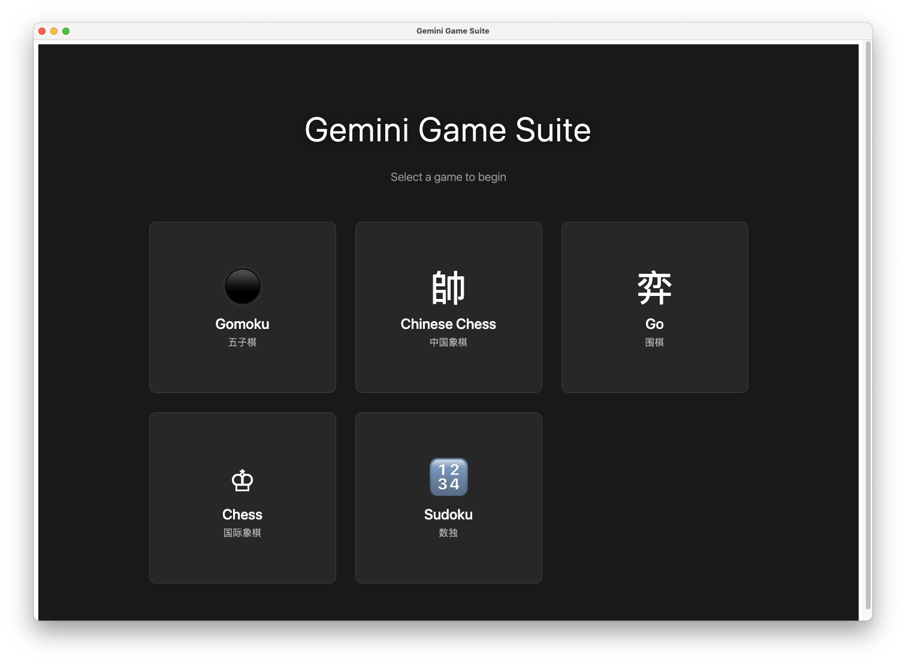
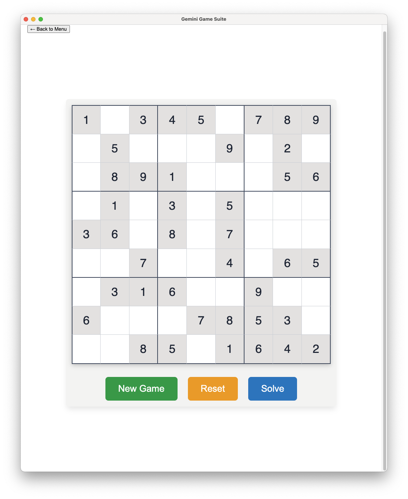
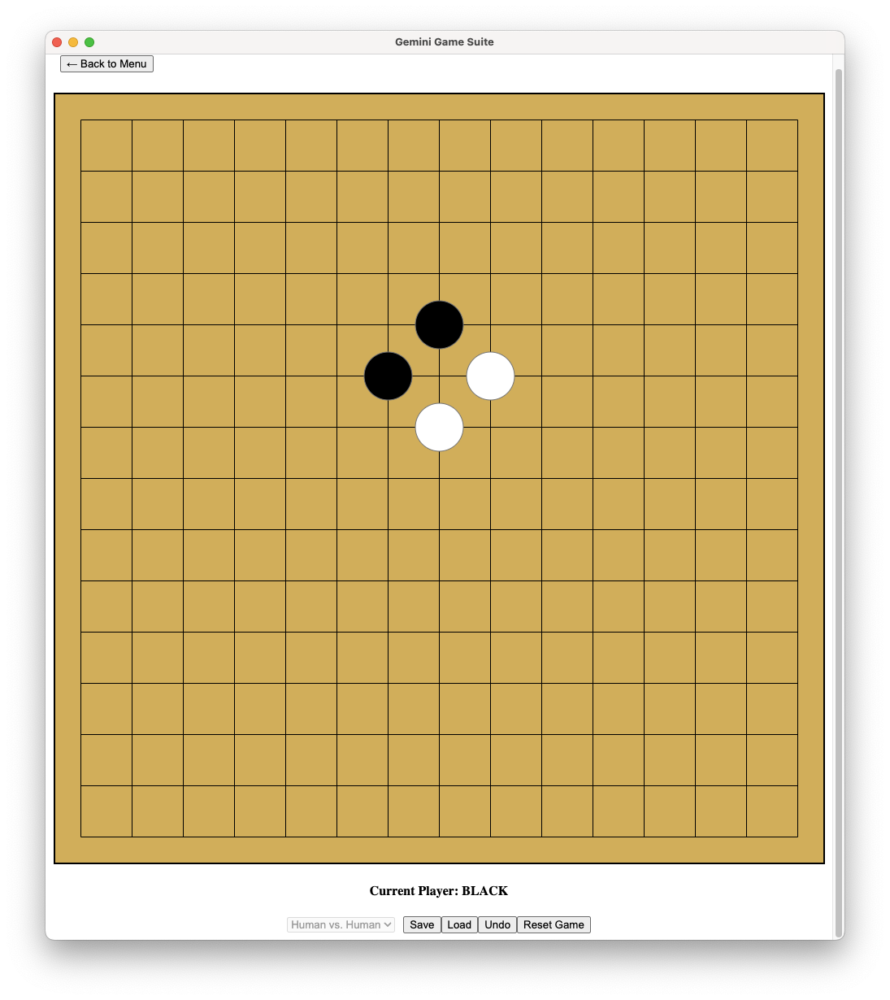
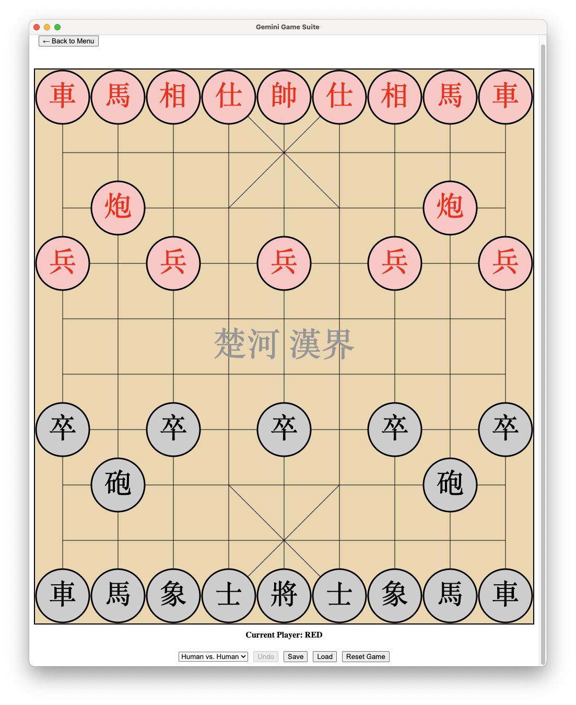
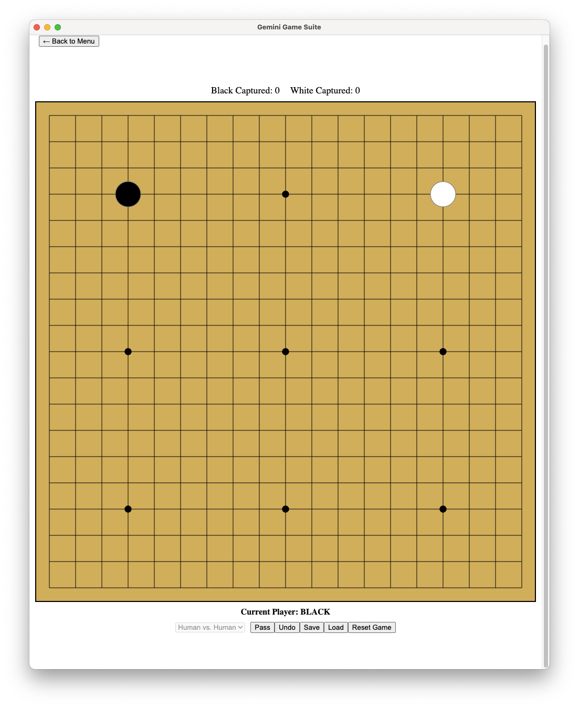
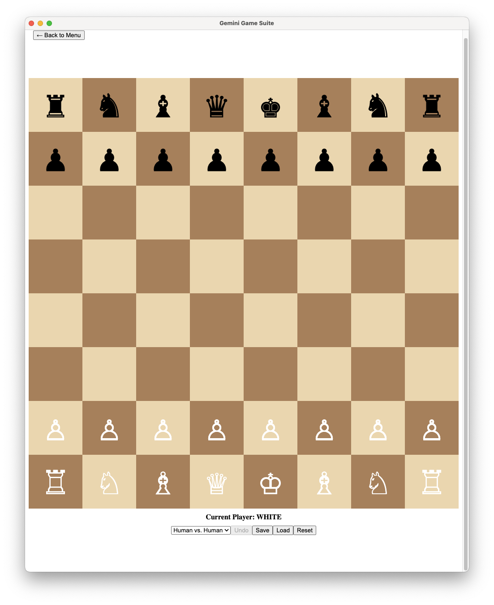

# 🎲 Gemini Game Suite

*A modern, elegant desktop application featuring a collection of classic board and puzzle games, built with Electron and React, and powered by Gemini AI.*

---

## 📸 Screenshots

| Home Screen | Sudoku Gameplay |
| :---: | :---: |
|  |  |

| Gomoku | Chinese Chess |
| :---: | :---: |
|  |  |

| Go | Chess |
| :---: | :---: |
|  |  |

---

This project is a showcase of classic games brought to life in a beautiful, minimalist desktop application. Play against a friend or challenge one of the custom-built AI opponents.

## ✨ Core Features

-   **Five Classic Games**: Enjoy Gomoku, Chinese Chess, Go, international Chess, and Sudoku.
-   **Dual Game Modes**: Play in **Human vs. Human** (`hvh`) or **Human vs. AI** (`hva`) mode for board games.
-   **Intelligent AI Opponents**:
    -   **Gomoku & Chess**: Feature a Minimax-based AI that can anticipate moves and play strategically.
    -   **Sudoku**: Includes a sophisticated solver that can generate puzzles and provide solutions instantly.
-   **Sleek, Modern UI**: A completely redesigned, minimalist user interface for an enjoyable and intuitive player experience.
-   **Fully Responsive Layout**: The game boards and UI elements dynamically adapt to any window size.
-   **Core Game Functions**: Save, load, undo, and reset functionality is available for all games.

## 🎮 Games Included

-   **Gomoku (五子棋)**
-   **Chinese Chess (中国象棋)**
-   **Go (围棋)**
-   **Chess (国际象棋)**
-   **Sudoku (数独)**: A feature-rich implementation with dynamic error highlighting and a responsive, adaptive layout.

## 🛠️ Tech Stack

-   **Framework**: [Electron](https://www.electronjs.org/)
-   **Frontend**: [React](https://reactjs.org/) with [TypeScript](https://www.typescriptlang.org/)
-   **Bundler**: [Vite](https://vitejs.dev/)
-   **Testing**: [Vitest](https://vitest.dev/)

## 🚀 Getting Started

### Prerequisites

-   [Node.js](https://nodejs.org/en/) (v18 or later recommended)
-   [Git](https://git-scm.com/)

### Installation & Running

1.  **Clone the repository:**
    ```bash
    git clone https://github.com/neohope/GeminiGameDemo.git
    cd GeminiGameDemo
    ```

2.  **Install dependencies:**
    ```bash
    npm install
    ```

3.  **Run the application in development mode:**
    ```bash
    npm run dev
    ```

---
*This project was collaboratively built with the help of Google's Gemini.*